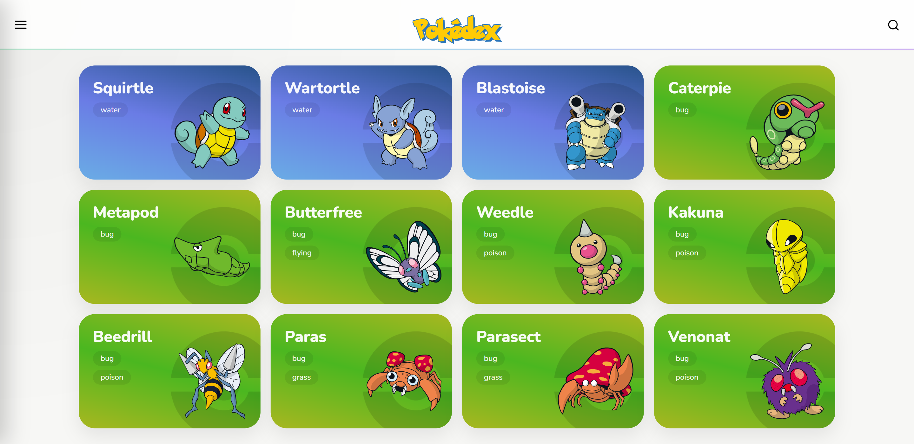
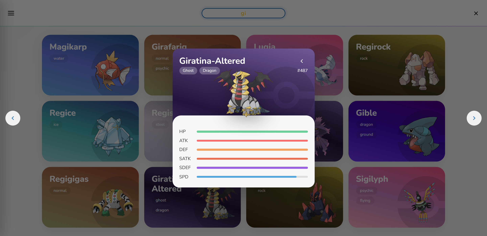

## 🧩 Pokédex — Vanilla JS Application
 
Web application built with pure JavaScript (ES6+), consuming the PokéAPI, structured with a modular architecture and manual state management, simulating responsibilities typically handled by modern frameworks.

🔗 **Live Demo:**
https://pokedex-lake-delta.vercel.app

## 🎥 Preview

  

 
##📸 Interface Overview

  
  

 

## 📌 Project Objective

This project was developed with a strong focus on:
	•	Organization and scalability
	•	Clear separation of responsibilities
	•	Framework-free state management
	•	Modular architecture
	•	Smooth and intuitive user experience

The goal was to build a complete application using only Vanilla JavaScript, reproducing architectural patterns commonly delegated to frameworks.

## ⚙️ Features
	•	🔍 Search by name or number
	•	🎛 Filter by type
	•	📄 Incremental pagination (Load More)
	•	🎨 Sprite view toggle
	•	📱 Modal navigation (buttons, keyboard, and swipe)
	•	⚡ Skeleton loading
	•	🎬 Progressive card animations
	•	🧠 Centralized global state

## 🧱 Architecture

The project is organized into independent modules, each with a well-defined responsibility:
	•	api/ → Communication with the PokéAPI
	•	state/ → Global state management
	•	pokemon/ → Card rendering and animations
	•	list/ → Pagination, search, and filters
	•	modal/ → Navigation and detailed view logic
	•	ui/ → Interface interactions

This separation reduces coupling, improves readability, and simplifies maintenance.

## 🔹 State Management

A centralized store handles:
	•	Complete dataset
	•	Visible list
	•	Active filters
	•	Current page
	•	Modal state
	•	View mode

This approach avoids cross-dependencies and keeps the application predictable and maintainable.

## 🔹 Separation of Concerns
	•	Rendering does not manipulate state
	•	State does not manipulate the DOM
	•	UI does not contain business logic

This layered structure keeps the codebase scalable and easier to reason about.

## 🛠 Technologies
	•	HTML5
	•	Modular CSS3
	•	JavaScript ES6+
	•	Fetch API
	•	PokéAPI
	•	Vercel (Deployment)

## 📈 Technical Highlights
	•	Performant DOM manipulation using DocumentFragment
	•	Manual state control (without frameworks)
	•	Responsibility-based modular structure
	•	API layer error handling
	•	Real environment deployment with network debugging

## 🚀 Next Steps
	•	Unit test implementation
	•	Loading optimization (lazy loading)
	•	Refactor toward a component-based architecture

 

## 👨‍💻 Author

Matheus Tavares
Front-End Developer

##
